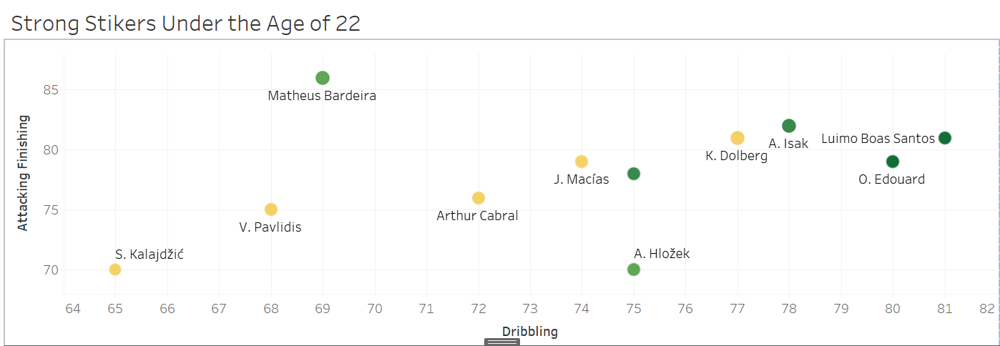
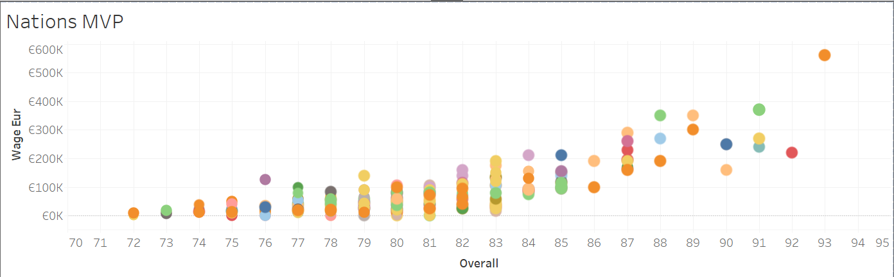

# FIFA 2021 Player Stats Analysis

This Tableau project provides an in-depth analysis of FIFA player statistics for the year 2021. It focuses on two key aspects: identifying strong strikers under the age of 22 and visualizing the nations with the most valuable players (MVPs) based on their overall scores and wages.

## Project Overview

The project utilizes data from the FIFA 2021 game, which includes comprehensive statistics for professional football players worldwide. The analysis aims to uncover insights and trends related to young promising strikers and the nations with the most valuable players.

## Dataset

The dataset used in this project is the FIFA 2021 player dataset, which contains various attributes for each player, including:

- Name
- Age
- Nationality
- Overall Rating
- Wage
- Position
- And many more...

## Visualizations

The project consists of two main visualizations:

### 1. Strong Strikers Under 22

This visualization identifies and showcases the top strikers aged 22 or younger based on their overall rating and potential. The interactive dashboard allows users to filter players by age, overall rating, potential, and other relevant attributes. It provides a clear overview of the most promising young strikers in the game.

### 2. Nations' MVPs: Overall Scores and Wages

This visualization presents a scatter plot displaying the nations' most valuable players (MVPs) based on their overall scores and wages. Each data point represents a player, and the visualization is color-coded by nationality, allowing users to easily identify the nations with the highest concentration of top-performing players. Additionally, tooltips provide detailed information about each player, including their name, club, overall rating, and wage.

## Key Findings

Through this analysis, several interesting findings have emerged:

- There is a strong pool of talented strikers under the age of 22, with players from various nations showcasing exceptional overall ratings and potential.
- Certain nations, such as France, England, and Brazil, have a high concentration of top-performing players with impressive overall scores and wages.
- The relationship between overall scores and wages varies among nations, indicating different strategies and approaches in player valuation and compensation.

## Usage

To explore the visualizations and findings of this project, you can access the Tableau workbook file (`Soccer 2021 Tableau.twbx`) using Tableau Desktop or Tableau Public. The workbook contains interactive dashboards and worksheets, allowing you to filter, sort, and customize the visualizations according to your preferences.

## Credits

This project was created by [Your Name] as part of a data analysis and visualization endeavor. The data used in this project is sourced from the FIFA 2021 game and is subject to the respective terms and conditions.

## License

This project is licensed under the [MIT License](LICENSE).
